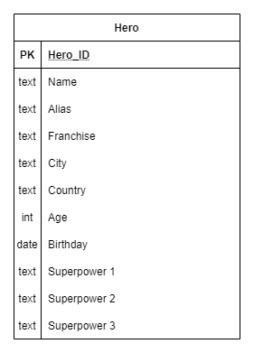
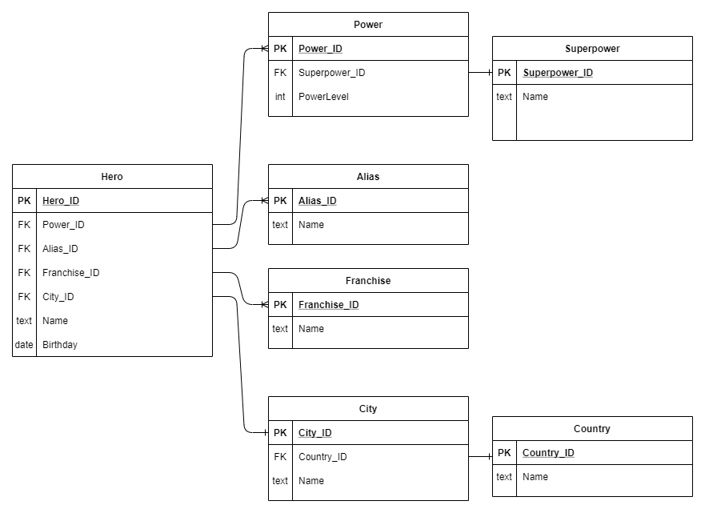

# Introduction to Database Normalization

A common trend or "rule of thumb" is that as your database system grows, becomes larger & more-complex, the level of database normalization you should be using increases. In this guide, we'll explain the most-straightforward levels of database normalization & use different sets of data at each level to help illustrate that point. 

We'll take a "database" that is more like a JSON object...

And turn it into a properly-structured database with relations & rules!

## What is database normalization?

Database normalization is a process to help you organize your data across tables, spreadsheets, and other rows-and-columns data management systems.

While it can be applied to any data management system or database type, it's especially useful for relational databases such as those used by SQL. Applications built with frameworks like Ruby On Rails will benefit from you using the right level of database normalization - it can improve your app in some very important ways.

Using database normalization correctly can lead to improved speed, stability and ease-of-development for your databases in your project. However, database normalization can easily be taken too far or not taken far enough, causing negative impacts on your application & database such as increased storage size and slower performance. This means it's important to know the different types of database normalization, how to use them, and when to use them. 

It's also worth noting that each level of database normalization requires all criteria of the previous level of normalization to be met. So 3NF requires all the rules of 2NF to be followed, plus another rule. And 2NF requires all the rules of 1NF to be followed, plus another rule. And so on & so on.

This guide will cover some of the more-common types of database normalization, but it won't be exhaustive. If this sort of content interests you, there is a lot of reading out there on this topic that you can dig up & go through!

## Table of Contents

[**0NF - Unnormalized form**](./pages/01_0nf.md)

This page is a look at the worst possible way to organize data: the 0NF. It's common to see this used when developers never actually learned about databases. It's rare in a professional setting. It features duplicated data, collections such as arrays within tables, and nonsensical table design.

[**1NF - First normal form**](./pages/02_1nf.md)

This is the most bare-minimum version of database normalization, where duplicate data & collections of data no longer exist. Instead, you have more and more rows of data. 

[**2NF - Second normal form**](./pages/03_2nf.md)

This is commonly where you'll see your first "join tables", and any databases you design to 2NF will really just be "3NF with unnecessary data". 

[**3NF - Third normal form**](./pages/04_3nf.md)

This is a nice "happy" level of optimization for most databases - you won't need to move up to any further levels in ***most*** databases. 3NF is basically "2NF with a better data layout" by removing all *transitive dependencies* in tables.

## Further Normalization Forms

We won't be covering these forms in this guide, but if you'd like to master as much of database normalization as possible then you can look into these other forms through your own research:

**EKNF - Elementary key normal form**

**BCNF - Boyce-Codd normal form**

**4NF - Fourth normal form**

**ETNF - Essential tuple normal form** 

**5NF - Fifth normal form**

**DKNF - Domain-key normal form**

**6NF - Sixth normal form**

